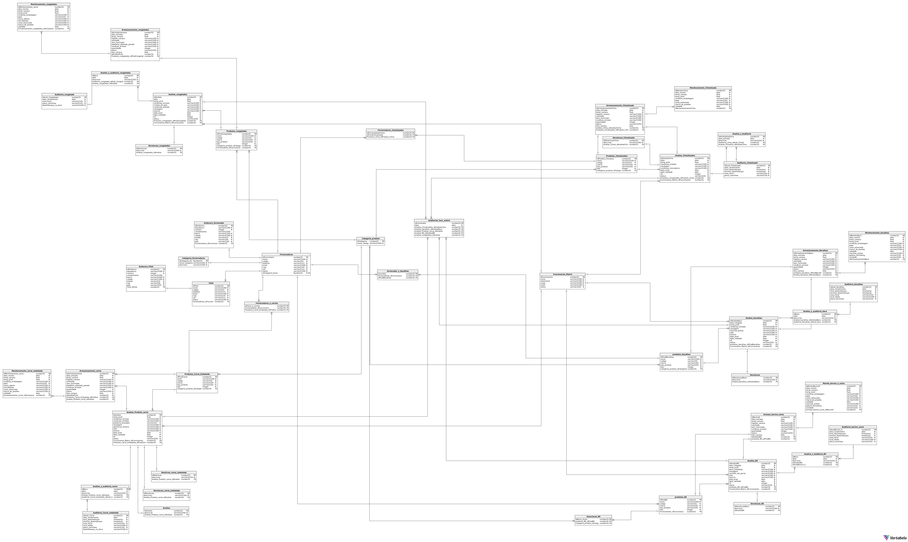
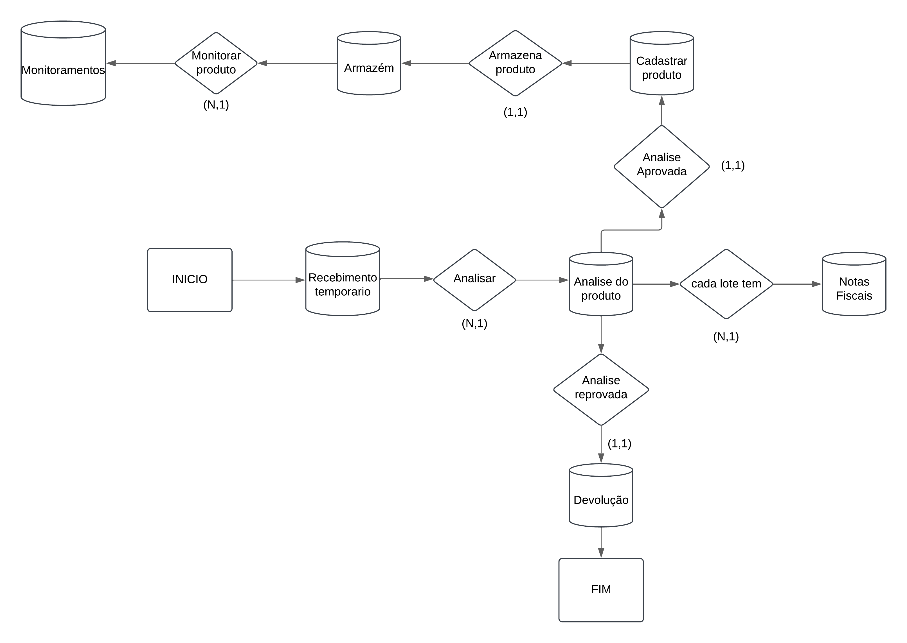

# Projeto de Banco de Dados para gerenciamento de um centro de distribuição alimentícios
***Por mais que os problemas citados aqui sejam reais, esse projeto é para fins acadêmicos e testes***  

## Índices
- Arquitetura
- Quais problemas esse projeto resolve
- Aplicativos usados
- Como o Banco de Dados Foi Criado
- Como se conectar ao banco de dados
    
# Arquitetura

Esse projeto nasceu da necessidade de resolver um problema enfrentado no centro de distribuição de alimentos perecíveis, especificamente no setor de qualidade. O profissional da qualidade tem a função de receber, analisar e aprovar os produtos, além de acompanhar o armazenamento adequadamente dessas mercadorias, monitorar o produto, manter controle de validade e realizar o PEPS (Primeiro a Entrar, Primeiro a Sair). Oprofissional é também responsável por identificar problemas a partir das reclamações das filiais e monitorar as temperaturas dos alimentos e do ambiente.

Entretanto, esse profissional enfrenta desafios significativos devido à falta de acesso ao sistema da empresa e à ausência de um computador para acompanhar esses alimentos desde o recebimento até a expedição. Essa situação dificultava a realização das tarefas desse profissional, gerando retrabalho e aumentando a possibilidade de erros.

### Quais problemas esse projeto resolve:
Esse projeto resolve diversos problemas, mas os principais são:

* Controle no Recebimento de Produtos: Permite registrar e acompanhar o recebimento de mercadorias.
* Análise e Aprovação dos Produtos: Facilita o registro das análises de qualidade e aprovação dos itens.
* Monitoramento de Armazenamento: Ajuda a garantir que os produtos sejam armazenados de acordo com as normas de qualidade.
* Controle de Validade: Mantém o controle de datas de validade para evitar perdas.
* Gestão de PEPS (Primeiro a Entrar, Primeiro a Sair): Organiza o fluxo dos produtos para que os mais antigos sejam utilizados primeiro.
* Monitoramento de Temperatura: Acompanha a temperatura dos produtos e do ambiente para preservar a qualidade.
* Redução de Retrabalho e Erros: Automatiza e centraliza os processos, minimizando a chance de erros humanos.
* Acesso Remoto ao Sistema: Evita a necessidade de um computador físico dedicado, oferecendo mobilidade ao profissional da qualidade.

### Aplicativos usados
* Lucidchart para modelagem de dados: (https://www.lucidchart.com/pages/pt)
* Oracle Cloud para criação do banco autonomos database para receber o backup do banco: https://www.oracle.com/br/cloud/
* Sistema de geranciamento SQLdeveloper para manipulação: https://www.oracle.com/database/sqldeveloper/technologies/download/
* VirtualBox para criação de um servidor linux: https://www.virtualbox.org/
* Putty para acesso remoto ao servidor: https://www.putty.org/

## Como o Banco de Dados Foi Criado

O banco de dados foi montado em uma máquina virtual (VM) que simula um servidor Oracle rodando o **Oracle Linux 8.10** com o **Oracle Database 21c**. A ideia é que essa VM funcione como ambiente de desenvolvimento, onde posso configurar, testar e ajustar o banco de dados.

Para facilitar o acesso, estou usando o **Autonomous Database**. Ele permite subir uma cópia do banco diretamente para a nuvem, o que elimina a necessidade de abrir a VM sempre que preciso acessar o banco. Assim, não é preciso iniciar o listener manualmente na VM toda vez que quero usar o banco de dados.

## Diagrama de cada setor
### Bacalhau

## Como se conectar ao banco de dados
Atualmente, estou finalizando a modelagem e a criação do banco de dados, corrigindo erros de codificação para garantir que ele funcione corretamente. Em seguida, subirei o banco para a nuvem e criarei um usuário para acesso.

